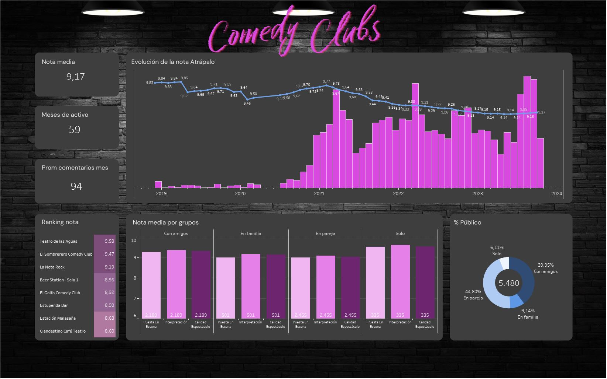
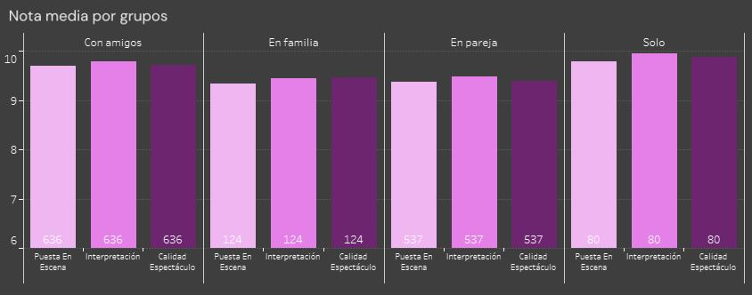
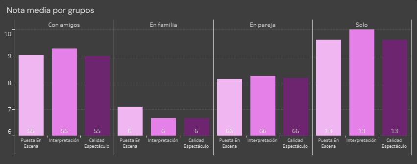
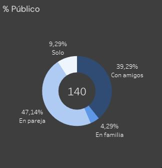

# Proyecto Final: Análisis de Comedy Clubs en Madrid

Este proyecto es la culminación de un bootcamp de 6 meses en Data Analytics y constituye la continuación de nuestro anterior proyecto "Dashboard_project: Análisis de Monólogos en Madrid", donde se llevó a cabo el scraping y visualización de datos de espectáculos de monólogos en Madrid desde el sitio web de Atrápalo.

## Atrapalo

Atrápalo es la web más importante de venta de entradas para monólogos en Madrid, donde el público comenta y puntúa los shows disfrutados. El posicionamiento de los diferentes shows y locales en la web depende del número de comentarios y la puntuación obtenida con estos.

## Tipos de Locales

En Madrid, los espectáculos de monólogos se presentan en diversos tipos de locales, cada uno con características distintivas:

- **Club de Comedia:** Espacios dedicados exclusivamente a la comedia, donde actúan comediantes profesionales.
- **Bar de Espectáculos:** Establecimientos que ofrecen una variedad de espectáculos en vivo, que pueden incluir comedia, música y magia, además de otros géneros.
- **Espacios Variados:** Lugares versátiles que pueden albergar una variedad de eventos, desde conciertos hasta espectáculos de comedia.
- **Mini Teatro:** Espacios íntimos con un aforo limitado, ofreciendo experiencias más cercanas con los artistas.
- **Teatros:** Establecimientos más grandes y formales que albergan producciones teatrales, conciertos y espectáculos de comedia.

## Descripción del Proyecto Actual

En este proyecto, se extrajeron comentarios de las cuentas de los clubs de comedia y de los shows realizados en esos locales. Sin embargo, el análisis se enfocó únicamente en las cuentas de los locales.

Se analizaron 8 clubs de comedia:

Teatro de las Aguas
El Sombrerero Comedy Club
La Nota Rock
Beer Station
El Golfo Comedy Club
Estupenda Bar
Estación Malasaña
Clandestino Café Teatro

Siguiendo la misma metodología aplicada en 'Beer Station', con 7 gráficas en Tableau:

1. Tabla de locales con sus puntuaciones, ordenada de mayor a menor, sirviendo de filtro para el resto de gráficas.
2. Indicador grande con la nota media del local seleccionado.
3. Indicador grande que muestra los meses de actividad del local seleccionado.
4. Indicador grande que muestra la media de comentarios por mes del local seleccionado.
5. Gráfico circular de donut con el porcentaje de público del local seleccionado y el número de comentarios en el centro.
6. Puntuación desglosada por tipo de público: interpretación artística, puesta en escena y puntuación general (sobre 10) del local seleccionado.
7. Gráfico principal de eje doble: línea que muestra la evolución de la nota a lo largo del tiempo y barras que muestran el número de comentarios recibidos por mes.

https://public.tableau.com/app/profile/estefania.castillo3331/viz/ComedyClubscuentaslocales/Dashboard1?publish=yes

## Objetivo del Proyecto

El objetivo de este proyecto fue crear un cuadro de mando para los clubs de comedia con el fin de analizar patrones de éxito o fracaso, así como tendencias en las puntuaciones. Es importante tener en cuenta que la calificación y posición del local en el sitio web afecta la compra de entradas para los shows.

## Teatro de las Aguas - Destacado

El 'Teatro de las Aguas' destaca con una puntuación de 9.58 sobre 10, basada en 1377 comentarios recopilados a lo largo de 40 meses. En los últimos 4 meses, ha recibido 380 comentarios, elevando ligeramente su calificación, a pesar de la tendencia general a la baja con una gran cantidad de comentarios.

En términos generales, en todos los locales se observa que la nota tiende a empezar alta y luego se estabiliza, aunque cada caso presenta tendencias diferentes. 'Teatro de las Aguas' se estabilizó rápidamente en un 9.6.

## Estación Malasaña 

El caso de ‘Estación Malasaña’ es la contraposición del ‘Teatro de las Aguas’, ya que es uno de los más longevos y su tendencia es a la baja y tiene dos picos de bajada notorios.

Solo puntúan alto los que vienen solos, pero solo constituyen el 9,29% del público, la mayoría vienen con amigos(39,29%), que suelen puntuar con un 9 de media o en pareja (47,14%) que suelen puntuar con una media de 8.

## Próximos Pasos

El siguiente paso será analizar los shows de cada local, así como sus puntuaciones y precios, para determinar si existe correlación entre estos datos.
